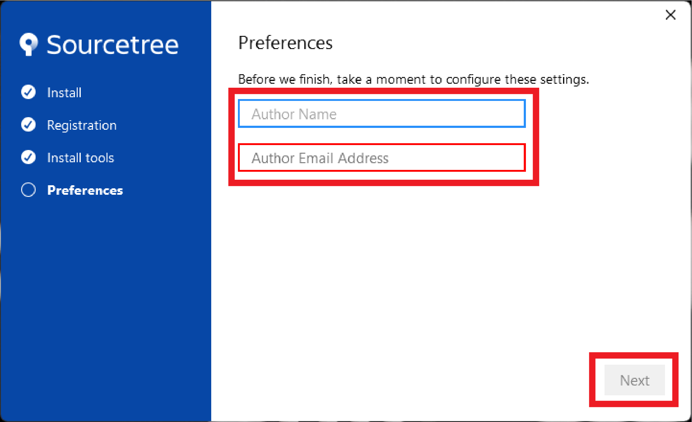

# SourceTree Installation Procedure

---

## Introduction

While working on the Trellis Toolkit Repositories we have addopted the practice of squashing our commits before rebasing. While there are many ways of completing this, we request that everyone uses [SourceTree](https://www.sourcetreeapp.com) to help visualize and assist with the rebase process.

If SourceTree is installed incorrectly, the result can cause issues with your authentication on the admin side. With this in mind we request that you follow the instructions to ensure you can ensure your code is processed in a more timely manner with minimal issues.

## Table of Contents

- [SourceTree Installation Procedure](#sourcetree-installation-procedure)
  - [Introduction](#introduction)
  - [Table of Contents](#table-of-contents)
  - [Requirements](#requirements)
  - [How To](#how-to)
  - [Moving Forward](#moving-forward)

## Requirements

1. A Windows or Mac Computer *(Linux is not currently supported)*
2. A cloned git repository stored locally on your computer.

## How To

    
Download SourceTree

    *SourceTreeApp Download*[https://www.sourcetreeapp.com]

<!--  -->

**Step 1:** Go to [SourceTreeApp.com](https://www.sourcetreeapp.com) and download the newest version of SourceTree.

    *SourceTreeApp License Agreement*

<!--  -->

**Step 2:** Once you select the download button a popup will appear with the SourceTree License Agreements, please read and accept.

    *Click Save File*

<!--  -->

**Step 3:** Click the 'Save' button when the 'Save As' dialog pops up.

    *Open file in bottom left of browser screen*

<!--  -->

**Step 4:** In the bottom left corner of the browser window you will see an option to open the file you just downloaded, select it and press open.

    
Install SourceTree

    

<!--  -->

**Step 5:** Select skip on bottom right of registration screen.

    

<!--  -->

**Step 6:** Select next on the install tools section.

    

<!--  -->

**Step 7:** Type in full name and email associated with your github account.

    

<!--  -->

**Step 8:** Select No for SSH Key Load.

    
Connect Local Repository

    

<!--  -->

**Step 9:** Select add in local tab.

    

<!--  -->

**Step 10:** Select browse and find the directory of your git repo

    

<!--  -->

**Step 11:** Select add once you find the repo.

    

<!--  -->

**Step 12:** Navigate through your repo!

## Moving Forward

This documentation has walked you through the installation of the SourceTree App and how to connect to your repositories locally. Moving forward you will need to check the procedures on how commits will be squashed and rebased into the main repositories.
